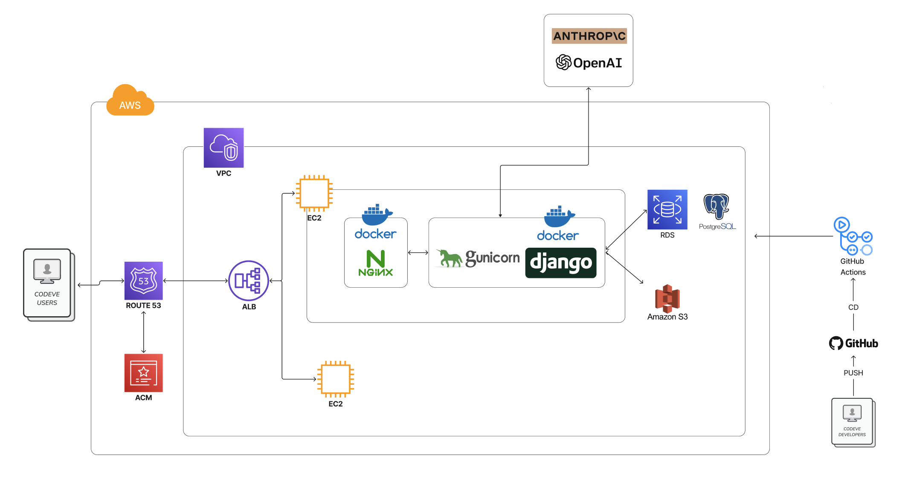

# CODEVE 프로젝트


### 네비게이션
1. [프로젝트 개요](#프로젝트-개요)
2. [팀 구성 및 역할](#팀-구성-및-역할)
3. [기술 스택](#기술-스택)
4. [프로젝트 구조](#프로젝트-구조)
5. [트러블 슈팅](#트러블-슈팅)
6. [SA 문서](#sa-문서)

### 🌼 프로젝트 개요
<details>
    <summary><strong> 기획 의도 </strong></summary>
    저희 팀은 모두 비전공자로 구성되어 있습니다. 프로그래밍을 처음 접했을 때, ‘변수는 왜 필요할까?’, ‘객체지향이 뭐야?’ 같은 기초 개념과 컴퓨터 사이언스 배경지식이 낯설고 어렵게 느껴졌던 경험이 있습니다. 특히, 부트캠프와 같은 빠르게 진행되는 교육 과정에서는 이러한 기초 지식 부족이 수업과 실습에 큰 어려움으로 다가왔습니다.

이러한 경험을 바탕으로, 저희는 **튜터가 옆에서 맞춤형 과외를 해주듯이 대화를 기반**으로 **프로그래밍의 기초를 빠르고 쉽게 이해할 수 있는 AI 기반 튜터링 서비스**를 기획하게 되었습니다. 복잡한 개념을 실생활 비유와 직관적인 설명으로 풀어내어 학습자가 부담 없이 배우고 성장할 수 있는 환경을 제공하고자 합니다.
</details>

<details>
    <summary><strong> 개발 기간 </strong></summary>
    2025.01.06 ~ 2025.01.30 약 4주
</details>

### 팀 구성 및 역할

|이름 |	역할 | 업무 |
-----|--------------|----------------------|
|강예진 | 백엔드, 프롬프트 엔지니어링, AI 엔지니어링 | 학습 자료 생성 LLM 구현, 답안 분석 및 피드백 AI 에이전트 구현, 자동화 스크립트 작성, 모델 설계 및 DB 구조화, API 엔드포인트 |
|강성민	| 백엔드, 게시판 기능, 챗봇 구현 | 와이어프레임 작성, 로직 흐름도, Javascript와 OpenAI를 이용해서 챗봇 구현, 로드맵 구현 |
|정재혁	| 프론트엔드, 백엔드, AWS 배포 | Django와 Tailwind CSS를 이용해서 UI 설계 및 구현, 사용자 관리 및 구글 로그인 기능 구현, AWS와 Nginx를 이용해서 배포 및 PostgreSQL를 이용해서 DB 생성 |


### 📚 기술 스택

<div align=center>

#### Frontend :  

#### Backend :    

#### AI :   

#### Database :  

#### Server :        

 

#### Collaboration :      

</div>

### 🫧 기술적 의사결정
<details>
    <summary>프론트 구현 | <strong>Django Template</strong> vs React</summary>
<table border="1">
    <tr>
        <th>항목</th>
        <th>Django Template</th>
        <th>React</th>
    </tr>
    <tr>
        <td>렌더링 방식</td>
        <td>SSR (서버 사이드 렌더링)</td>
        <td>기본적으로 CSR (클라이언트 사이드 렌더링)</td>
    </tr>
    <tr>
        <td>초기 로딩 속도</td>
        <td>빠름 (HTML 자체 전달)</td>
        <td>JS 번들 로딩까지 대기 필요 (SSR 적용 전제 제외 시)</td>
    </tr>
    <tr>
        <td>SEO(검색 최적화)</td>
        <td>유리 (서버 렌더링으로 콘텐츠 완전 제공)</td>
        <td>순수 CSR 시 제한적 (SSR 프레임워크 적용 시 개선 가능)</td>
    </tr>
    <tr>
        <td>상호작용/동적 UI</td>
        <td>제한적 (AJAX와 약간의 JS로 가능하지만 규모가 제한됨)</td>
        <td>강력 (SPA 구현과 동적 상태 관리, 부분 렌더링 용이)</td>
    </tr>
    <tr>
        <td>학습 곡선</td>
        <td>Django(파이썬) 지식으로 충분, 템플릿 문법만 숙지하면 됨</td>
        <td>React 기본 문법 + 자바스크립트 생태계(webpack 등) 학습 필요</td>
    </tr>
    <tr>
        <td>프로젝트 구조</td>
        <td>서버 템플릿 기반, 전통적 웹 방식</td>
        <td>백엔드/프론트엔드 분리, API 통신 기반 SPA</td>
    </tr>
    <tr>
        <td>확장성</td>
        <td>단일 프로젝트로 간단하지만 큰 규모 확장 시 제약 있을 수 있음</td>
        <td>프론트엔드/백엔드 분리로 대규모 프로젝트에도 유연함</td>
    </tr>
    <tr>
        <td>배포/호스팅</td>
        <td>Django 서버 하나만 배포하면 됨</td>
        <td>프론트엔드와 백엔드를 각각 빌드/배포해야 함</td>
    </tr>
</table>
<p><strong>의사결정:</strong> <span style="color: orange; font-weight: bold;">Django Template</span>은 서버 사이드 렌더링으로 SEO, 초기 로딩 속도, CRUD 서비스에 적합하며, 통합 배포와 유지보수가 용이하다. React는 동적 UI와 확장성이 뛰어나지만, 현재 프로젝트의 요구사항과 유지보수 전략을 고려했을 때 <span style="color: orange; font-weight: bold;">Django Template</span>이 최적의 선택이라고 생각했습니다.</p>
</details>

<details>
    <summary>DB 구축 | <strong>PostgreSQL</strong> vs MySQL</summary>
    <table border="1">
        <tr>
            <th>특징</th>
            <th>PostgreSQL</th>
            <th>MySQL</th>
        </tr>
        <tr>
            <td>성능</td>
            <td>복잡한 쿼리 및 대규모 데이터 처리에 우수</td>
            <td>단순한 쿼리에서 빠른 성능</td>
        </tr>
        <tr>
            <td>확장성</td>
            <td>수평적 확장성 뛰어남</td>
            <td>수직적 확장성에 강점</td>
        </tr>
        <tr>
            <td>호환성</td>
            <td>SQL 표준 준수, 다양한 언어 호환</td>
            <td>가벼운 데이터베이스 시스템</td>
        </tr>
        <tr>
            <td>트랜잭션</td>
            <td>강력한 트랜잭션 관리, MVCC 지원</td>
            <td>InnoDB를 통한 ACID 지원</td>
        </tr>
        <tr>
            <td>기능</td>
            <td>고급 기능 및 복잡한 데이터 모델링 지원</td>
            <td>기본적인 RDBMS 기능 지원</td>
        </tr>
        <tr>
            <td>지원</td>
            <td>활발한 커뮤니티 및 엔터프라이즈 지원</td>
            <td>Oracle 지원, 커뮤니티 지원</td>
        </tr>
        <tr>
            <td>배포</td>
            <td>설정이 복잡할 수 있음</td>
            <td>간편한 설정과 배포</td>
        </tr>
    </table>

<p><strong>의사결정:</strong> 기술 사용에 있어서 <span style="color: orange; font-weight: bold;">PostgreSQL</span>과 MySQL 사용을 놓고 고민하다가, 대규모 데이터를 다루거나 장기적인 확장성과 안정성을 고려하여 <span style="color: orange; font-weight: bold;">PostgreSQL</span>을 선택하게 되었습니다.</p>
</details>

<details>
    <summary>챗봇 LLM | <strong>OpenAPI</strong> vs Anthopic API</summary>
<table border="1">
    <tr>
        <th>모델</th>
        <th>GPT-4o Mini</th>
        <th>GPT-o1-mini</th>
        <th>Claude 3.5 Sonnet</th>
    </tr>
    <tr>
        <td>성능</td>
        <td>고급 언어 작업, 다분야 학습, 복잡한 논리적 추론에 강점</td>
        <td>추론 기능이 좋아진 모델. 단순작업에 적합하나 생성된지 얼마 안되어 일부 성능 부족.</td>
        <td>장기 문맥 이해, 자연스러운 언어 생성, 감성적 표현에 강점</td>
    </tr>
    <tr>
        <td>입력 비용 (백만 토큰당)</td>
        <td>$0.15</td>
        <td>$3</td>
        <td>$3</td>
    </tr>
    <tr>
        <td>출력 비용 (백만 토큰당)</td>
        <td>$0.60</td>
        <td>$12</td>
        <td>$15</td>
    </tr>
    <tr>
        <td>응답 속도</td>
        <td>2.7초</td>
        <td>9초</td>
        <td>4.5초</td>
    </tr>
    <tr>
        <td>멀티모달 지원</td>
        <td>텍스트, 이미지</td>
        <td>텍스트, 이미지</td>
        <td>텍스트, 이미지</td>
    </tr>
    <tr>
        <td>컨텍스트 길이</td>
        <td>128,000 토큰</td>
        <td>128,000 토큰</td>
        <td>200,000 토큰</td>
    </tr>
</table></strong>

<p><strong>의사결정:</strong> 비용 효율성, 응답 속도, 간단한 응답이 우리가 사용하는 기술 요구 사항인 점을 고려했을 때, 
    <span style="color: orange; font-weight: bold;">GPT-o1-mini</span> 와 
    <span style="color: orange; font-weight: bold;">Claude 3.5 Sonnet</span> 보다 
    <span style="color: orange; font-weight: bold;">GPT-4o-mini</span> 모델을 선택하는 것이 합리적이라고 판단하여 선택하게 되었습니다.
</p>

</table>
</details>
<details>
    <summary>LLM 기반 학습자료 생성 | 멀티 에이전트 vs <strong>	
프롬프트 엔지니어링 </strong></summary>
<table border="1">
    <tr>
        <th>항목</th>
        <th>멀티에이전트 구조</th>
        <th>프롬프트 체인</th>
    </tr>
    <tr>
        <td>구현 복잡도</td>
        <td>
            - 각 단계별 독립적 에이전트 설계 필요<br>
            - 에이전트 간 데이터 연계 및 API 설계 필요<br>
            - 학습 곡선이 높음
        </td>
        <td>
            - 단일 LLM 컨텍스트에서 프롬프트 최적화<br>
            - 추가 설계 없이 빠르게 적용 가능
        </td>
    </tr>
    <tr>
        <td>비용 효율성</td>
        <td>
            - 특정 단계에서 Function Calling 사용 가능<br>
            - 초기 개발 비용과 관리 비용이 큼
        </td>
        <td>
            - 초기 비용 낮음<br>
            - 대규모 데이터 처리 시 비용 증가 가능성 있음
        </td>
    </tr>
    <tr>
        <td>확장성과 유지보수</td>
        <td>
            - 새로운 학습 단계나 기능 추가에 유리<br>
            - 복잡도가 높아질수록 유지보수 어려움
        </td>
        <td>
            - 초기 유지보수 간단<br>
            - 새로운 역할 추가 시 프롬프트 수정으로 간단히 적용<br>
            - 학습 단계 증가 시 프롬프트 관리 복잡성 증가 가능성
        </td>
    </tr>
    <tr>
        <td>프로젝트 완료 가능성</td>
        <td>
            - 마감 기한 내 완벽한 구현 부담 큼<br>
            - 높은 유연성과 효율성 제공 가능
        </td>
        <td>
            - 구현 속도 빠름<br>
            - 단기 프로젝트에 적합
        </td>
    </tr>
    <tr>
        <td>장점</td>
        <td>
            - 독립적이고 유연한 구조 제공<br>
            - 확장성 및 효율성 우수
        </td>
        <td>
            - 구현 속도 빠름<br>
            - 단기 프로젝트에 적합
        </td>
    </tr>
    <tr>
        <td>단점</td>
        <td>
            - 높은 초기 개발 비용과 학습 필요<br>
            - 시간 제약 내 구현 어려움<br>
            - 에이전트 수만큼 레이턴시 증가 가능
        </td>
        <td>
            - 확장성과 유연성 제한<br>
            - 복잡한 기능 추가 시 프롬프트 수정 필요<br>
            - 멀티에이전트가 효율적으로 풀 수 있는 문제에서 성능이 떨어질 수 있음
        </td>
    </tr>
</table>
<p>
    최종적으로, <span style="color: orange; font-weight: bold;">프로젝트를 성공적으로 완료</span>하기 위해 
    <span style="color: orange; font-weight: bold;">프롬프트 체인</span> 방식을 선택했습니다. 
    <span style="color: orange; font-weight: bold;">프롬프트 체인</span>은 
    <span style="color: orange; font-weight: bold;">단일 LLM 내에서 프롬프트를 통해 작업 단계를 연결</span>하는 방식으로, 
    이론, 실습, 과제, 회고 등 각 단계를 빠르게 처리할 수 있도록 설계되었습니다. 
    이는 <span style="color: orange; font-weight: bold;">빠른 구현과 초기 비용 절감</span>이라는 장점이 있지만, 
    장기적으로 확장성과 유연성의 부족이라는 한계를 가질 수 있음을 인지하고 있습니다.
</p>
<p>
    따라서, 시스템이 안정화되고 추가적인 리소스와 시간이 확보된다면, 
    멀티에이전트 구조를 도입하여 학습 단계를 더욱 유기적으로 연결하고, 
    전반적인 <strong>효율성을 강화</strong>할 계획입니다.
</p>
</details>

### 🖋️ 주요 아키텍처
<details>
    <summary> 프로젝트 아키텍처 </summary>


</details>

<details>
    <summary> 와이어프레임 </summary>


</details>

<details>
    <summary> ERD </summary>

</details>


### 💡 주요 기능
#### LLM을 활용한 교육 콘텐츠 생성
- 이론/실습/과제/회고 각 단계별 맞춤 컨텐츠 생성
- 각 학습 단계에 특화된 LLM 모듈 구현 (theory_llm.py, practice_llm.py, assignment_llm.py)
- 컨텐츠 품질 관리를 위한 사전 생성 방식 채택
#### LangChain 기반 학습 분석 시스템
- 과제 답안 자동 분석 시스템 (assignment_analysis_agent.py)
- 실습 결과 평가 시스템 (practice_analysis_agent.py)
- 개인화된 피드백 생성 파이프라인
#### 통합 학습 관리 시스템
- 학습 진도 추적 시스템 (roadmaps)
- 개인화된 학습 경로 관리
- 학습 데이터 분석 및 저장
#### 프로그래밍 용어 사전 챗봇
- 실시간 프로그래밍 용어 검색 및 설명
- 대화형 인터페이스를 통한 개념 설명


### 🗝️ 트러블슈팅
<details>
<summary>강예진 🌱</summary>
<p><strong>1. 이론-실습 예제 불일치 문제</strong></p>
<p><strong>문제 상황</strong></p>
<pre><code>
default_examples = {
    'input_output': {
        'code': '# 예제 코드...',
        'pattern': {...}
    }
}
</code></pre>
PracticeLLM에서만 예제 코드 패턴을 정의하고 검증하는 로직을 넣어서 코드 패턴의 불일치가 생겼다. 

<p><strong>원인</strong></p>
이론(ThreoryLLM)과 실습(PracticeLLM) 사이의 예제 코드 생성 기준이 달라 불일치가 생겼다.
이는 실습에서 기대하는 코드 패턴이 이론에서 제시된 예제와 맞지 않아서 발생하였다.
<p><strong>해결</strong></p>
<pre><code>
class TheoryLLM(BaseLLM):
    def __init__(self, model_name="gpt-4", temperature=0.7):
        self.example_patterns = {
            'input_output': {
                'structure': ['input(', 'print('],
                'output_pattern': r'안녕하세요.*!',
                'required_elements': ['input', 'print', '사용자 입력']
            }
        }
        
    def _validate_example_code(self, code: str, topic_id: str) -> bool:
        if topic_id not in self.example_patterns:
            return True
        pattern = self.example_patterns[topic_id]
        # 패턴 검증 로직...
</code></pre>
TheoryLLM에 예제 코드 패턴 정의 및 검증 로직을 추가 하였다.

<strong>2. 실시간 피드백 시스템 개선</strong>
<p><strong>문제 상황</strong></p>
처음에는 제출된 코드를 단순히 실행하고 결과만 확인하는 방식이였으나, 성공만 알려주는게 학습에 도움이 되지 않는 것 같아 학습에 도움을 주기 위해 보완하기로 하였다. 
<pre><code>
# 초기 구현 - 너무 단순한 피드백
def analyze_submission(self, code: str) -> Dict:
    try:
        exec(code)
        return {"success": True, "message": "성공!"}
    except Exception as e:
        return {"success": False, "message": str(e)}
</code></pre>

<p><strong>개선 과정</strong></p>
   1. 실제 학습자들의 피드백을 수집하고 분석
   2. 다른 교육용 플랫폼들의 피드백 시스템 벤치마킹
   3. 코드 품질과 학습 목표 달성 여부를 측정할 방법 고민

<p><strong>해결 과정</strong></p>
코드 분석과 실행을 분리하고, 여러 측면에서 피드백을 제공하는 방식으로 개선하였다.

<pre><code>
class CodeAnalyzer:
    def analyze_code_quality(self, code: str) -> Dict:
        metrics = {
            'has_comments': self._check_comments(code),
            'follows_convention': self._check_naming_convention(code),
            'code_structure': self._analyze_structure(code)
        }
        
        feedback = []
        if metrics['has_comments']:
            feedback.append("✨ 주석을 통해 코드의 의도를 잘 설명했어요!")
        
        # 실행 결과 분석
        try:
            result = self._safe_execute(code)
            if result['success']:
                feedback.append("🎯 코드가 정상적으로 동작합니다!")
                if self._check_creative_solution(code):
                    feedback.append("🌟 창의적인 해결 방법이네요!")
        except Exception as e:
            feedback.append(f"💡 오류가 발생했어요: {str(e)}\n다음을 확인해보세요:")
            feedback.extend(self._generate_error_hints(e))
            
        return {'metrics': metrics, 'feedback': feedback}
</code></pre>
이런 개선을 통해 학습자들이 더 구체적이고 유익한 피드백을 받을 수 있으며, 코드 품질도 자연스럽게 향상될 것으로 기대된다. 이를 통해 사용자 경험을 고려한 개선의 중요성을 더욱 실감하게 되었다.

<strong>3. LLM 응답 템플릿 커스터마이징</strong>
<p><strong>문제 상황</strong></p>
처음에는 ChatGPT API를 사용하여  이론 내용을 생성할 때, HTML 구조가 일관적이지 않고 스타일링이 제각각으로 보였다. 특히 코드 블록이나 강조 구문이 때때로 깨지는 현상이 발생하였다.
<pre><code>
# 초기 구현 - 단순한 프롬프트 사용
messages = [{
    "role": "user",
    "content": f"Python {topic_id}에 대한 설명을 HTML로 작성해주세요."
}]
</code></pre>
<p><strong>문제 분석 과정</strong></p>
    1. 개발자 도구로 생성된 HTML을 분리해보니 태그 구조가 불규칙적
    2. ChatGPT 응답을 로깅해서 살펴보니 때때로 마크다운과 HTML이 섞여서 출력
    3. Tailwind CSS 클래스가 누락되거나 잘못 적용되는 부분 발견
<p><strong>해결 과정</strong></p>
여러 시도 끝에 프롬프트에 상세한 템플릿을 제공하고, 응답을 구조화하는 방식을 택했다.
<pre><code>
class TheoryLLM(BaseLLM):
    def __init__(self):
        self.prompt_template = """
"""
</code></pre>
이렇게 구조화된 템플릿을 사용하니 응답의 일관성이 증가하였고, 스타일링도 안정적으로 적용되었다.

</details>

<details>
<summary>강성민 🌿</summary>
<p>1. 챗봇 단어 분리</p>

저장해놓은 답변을 불러오는데 문장을 입력했을때 일정 단어가 들어가면 저장해놓은 답변을 불러오는 코드가 있다. 그런데 문장단위로 쓰게되면 인식을 못하여 불필요한 단어들을 제거하고 메시지를 단어로 분리한 다음에 저장해놓은 답변을 불러오도록 하였다(ex, 변수가 뭐야? → 변수 답변이 나옴)
<pre><code>
class ChatbotViewSet(viewsets.ViewSet):
    def __init__(self, **kwargs):
        super().__init__(**kwargs)
        # responses.json 파일 로드
        json_path = os.path.join(os.path.dirname(__file__), 'responses.json')
        with open(json_path, 'r', encoding='utf-8') as f:
            self.cached_responses = json.load(f)
            
    def extract_keywords(self, message):
        # 불필요한 단어들 제거
        stop_words = ['이란', '란', '이', '가', '은', '는', '을', '를', '에', '대해', '뭐야', '무엇', '설명', '해줘', '알려줘', '?', '.']
        
        # 메시지를 단어로 분리
        words = message.replace('?', ' ').replace('.', ' ').split()
        
        # 불필요한 단어 제거
        keywords = [word for word in words if word not in stop_words]
        
        return keywords
</code></pre>

<p>2. 자바스크립트 이미지 호출</p>
기존에는 프로젝트 내의 static 폴더에서 이미지를 호출하고 있었으나, 배포 과정에서 S3 버킷에서 이미지를 불러오는 방식으로 변경되었음. 그러나 자바스크립트에서는 Django 템플릿 방식이 작동하지 않아, 이미지를 하드코딩된 S3 URL로 호출하는 방식으로 수정하여서 해결. 이후에도 이미지 업로드가 되지 않아, S3 버킷에서 CORS 설정을 추가하여 요청을 처리할 수 있도록 하여 최종적으로 해결함

```html
기존 코드 - 

수정코드 - 
```
<pre><code>
CORS설정

[
    {
        "AllowedHeaders": [
            "*"
        ],
        "AllowedMethods": [
            "GET",
            "PUT",
            "POST",
            "DELETE",
            "HEAD"
        ],
        "AllowedOrigins": [
            "https://codeve.site",
            "http://localhost:8000",
            "http://127.0.0.1:8000"
        ],
        "ExposeHeaders": [
            "Access-Control-Allow-Origin"
        ]
    }
]
</code></pre>


</details>

<details>
<summary>정재혁 🍀</summary>
<strong>1. 장고 정적 파일 로드 문제</strong>
- 상황 설명
Django 프로젝트에서 템플릿을 작성하던 중 다음과 같은 오류가 발생했다:
TemplateSyntaxError at /api/courses/practice/input_output/
Invalid block tag on line 6: 'static', expected 'endblock'. Did you forget to register or load this tag?

- 원인
정적 파일을 로드하기 위해 ``를 사용하려면 템플릿 상단에 ``가 있어야 한다.

- 해결
<pre><code>

<!DOCTYPE html>
<html>
<head>
</code></pre>

<strong>2. 8000번 포트가 이미 사용 중 문제</strong>
- 상황 설명
Error: That port is already in use.

- 해결
lsof -i :8000로 8000번 포트를 사용하고 있는 프로세스를 찾은 후
kill -9 7765 7813 8327 8585로 해당 프로세스들을 종료

<strong>3. 배포했는데 static 폴더에 있는 미디어 파일들이 뜨지 않음 현상</strong>
- 원인
nginx 설정 파일에 문제가 있어서 발생한 오류.
location 지시문이 server 블록 내부에 위치해야 하는데 잘못된 위치에 있었음.

- 해결
<pre><code>
server {
    root /www/data;
    location / {
    }
}
위처럼 location 지시문을 server 블록에 위치하게 함.
</code></pre>
</details>

### 📂 프로젝트 구조
```
Codeve/
│
├── .github/                # GitHub 관련 설정 파일
│
├── accounts/               # 사용자 계정 관리
│   ├── templates/accounts  # 계정 관련 템플릿
│   ├── models.py           # User, SocialAccount 모델
│   ├── views.py            # 로그인/회원가입 등 계정 관련 뷰
│   ├── serializers.py      # 사용자 데이터 직렬화
│   └── urls.py             # accounts 관련 URL 라우팅
│
├── courses/                # 이론, 실습, 과제, 회고 관리
│   ├── agents/              # AI 분석 에이전트 모듈
│   │   ├── base_agent.py          # 에이전트 기본 클래스
│   │   ├── practice_analysis_agent.py    # 실습 분석 에이전트
│   │   └── assignment_analysis_agent.py  # 과제 분석 에이전트
│   │
│   ├── llm/                 # LLM 컨텐츠 생성 모듈
│   │   ├── base_llm.py           # LLM 기본 클래스
│   │   ├── theory_llm.py         # 이론 컨텐츠 생성
│   │   ├── practice_llm.py       # 실습 문제 생성
│   │   ├── assignment_llm.py     # 과제 생성
│   │   └── reflection_llm.py     # 회고 가이드 생성
│   │
│   ├── scripts/             # 유틸리티 스크립트
│   │   └── assignment_tools.py    # 과제 관리 도구
│   │
│   ├── config/              # 설정 파일
│   │   └── constants.py          # 상수 및 설정값
│   │
│   ├── data/                # 학습 데이터 저장소
│   │   └── topics/               # 주제별 학습 자료
│   │
│   ├── templates/           # 템플릿 파일
│   │   ├── courses/              # 코스 관련 템플릿
│   │   └── practice/             # 실습 관련 템플릿
│   │
│   ├── models.py            # 코스 데이터베이스 모델
│   ├── views.py            # 코스 뷰 로직 (API & 렌더링)
│   ├── urls.py             # 코스 URL 라우팅
│   └── serializers.py      # API 시리얼라이저 
│
├── roadmaps/               # 학습 경로 관리
│   ├── templates/roadmaps  # 학습 경로 템플릿
│   ├── models.py           # Roadmap, Step 모델
│   ├── views.py            # 학습 경로 CRUD 및 진행 상황
│   ├── serializers.py      # 학습 경로 데이터 직렬화
│   └── urls.py             # 로드맵 관련 URL 라우팅
│
├── communities/            # 커뮤니티 기능
│   ├── templates/communities/ # 커뮤니티 템플릿
│   ├── models.py           # Post 모델
│   ├── views.py            # 게시글 CRUD
│   ├── serializers.py      # 커뮤니티 데이터 직렬화
│   └── urls.py             # 커뮤니티 관련 URL 라우팅
│
├── chatbot/                # AI 기능
│   ├── templates/chatbots  # AI 서비스 템플릿
│   ├── models.py           # GPT 기반 Python 학습 챗봇
│   ├── views.py            # 챗봇 관련 뷰뷰
│   ├── serializers.py      # 챗봇 데이터터 직렬화
│   └── urls.py             # AI 유틸리티 함수
│
├── Codeve/                 # 프로젝트 설정
│   ├── __init__.py         # Python 패키지 선언
│   ├── asgi.py             # ASGI 설정
│   ├── settings.py         # Django 설정
│   ├── urls.py             # 메인 URL 라우팅
│   └── wsgi.py             # WSGI 설정
│
├── templates/base          # 전역 템플릿
├── .gitignore              # Git 제외 파일 설정
├── Dockerfile              # Docker 설정 파일
├── manage.py               # Django 관리 스크립트
├── requirements.txt        # 프로젝트 의존성
└── README.md               # 프로젝트 설명 및 실행 가이드


```


### 📕 API 엔드포인트
[API 명세](https://www.notion.so/teamsparta/v2-3a35ccd6631543c88d7738d2b3a5ebbc?pvs=4#1742dc3ef51481828994f2c1dd4c0b25)
### 📗 SA 문서
[팀 메타몽 SA 문서](https://www.notion.so/teamsparta/SA-v2-5e3a147b921b43fd87ff2ab774d8c06f)
