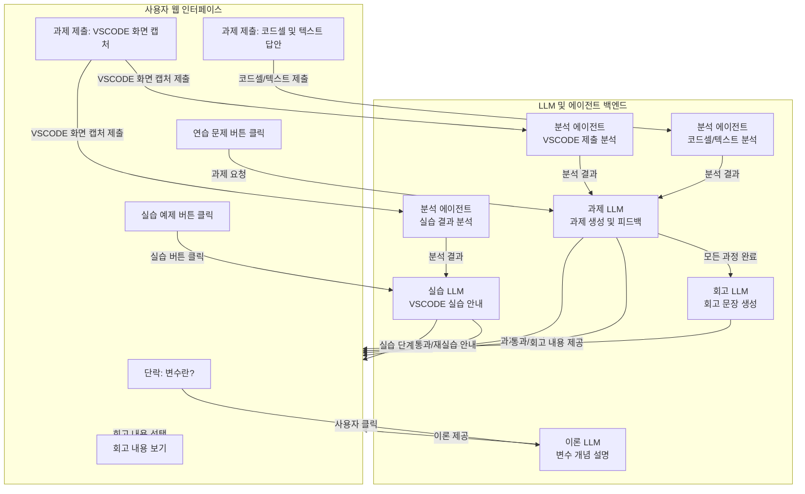

```mermaid
graph TD
    %% Webpage
    subgraph Webpage["사용자 웹 인터페이스"]
        Section["단락: 변수란?"]
        ExampleBtn["실습 예제 버튼 클릭"]
        ExerciseBtn["연습 문제 버튼 클릭"]
        SubmitBtn1["과제 제출: VSCODE 화면 캡처"]
        SubmitBtn2["과제 제출: 코드셀 및 텍스트 답안"]
        ReflectionBtn["회고 내용 보기"]
    end

    %% Backend
    subgraph Backend["LLM 및 에이전트 백엔드"]
        TheoryLLM["이론 LLM<br>변수 개념 설명"]
        PracticeLLM["실습 LLM<br>VSCODE 실습 안내"]
        PracticeAgent["분석 에이전트<br>실습 결과 분석"]
        AssignmentLLM["과제 LLM<br>과제 생성 및 피드백"]
        AssignmentAgent1["분석 에이전트<br>VSCODE 제출 분석"]
        AssignmentAgent2["분석 에이전트<br>코드셀/텍스트 분석"]
        ReflectionLLM["회고 LLM<br>회고 문장 생성"]
    end

    %% Connections
    Section -->|사용자 클릭| TheoryLLM
    TheoryLLM -->|이론 제공| Webpage

    ExampleBtn -->|실습 버튼 클릭| PracticeLLM
    PracticeLLM -->|실습 단계 안내| Webpage
    SubmitBtn1 -->|VSCODE 화면 캡처 제출| PracticeAgent
    PracticeAgent -->|분석 결과| PracticeLLM
    PracticeLLM -->|통과/재실습 안내| Webpage

    ExerciseBtn -->|과제 요청| AssignmentLLM
    AssignmentLLM -->|과제 제공| Webpage
    SubmitBtn1 -->|VSCODE 화면 캡처 제출| AssignmentAgent1
    AssignmentAgent1 -->|분석 결과| AssignmentLLM
    SubmitBtn2 -->|코드셀/텍스트 제출| AssignmentAgent2
    AssignmentAgent2 -->|분석 결과| AssignmentLLM
    AssignmentLLM -->|통과/추가 과제 안내| Webpage

    AssignmentLLM -->|모든 과정 완료| ReflectionLLM
    ReflectionLLM -->|회고 내용 제공| Webpage
    Webpage -->|회고 내용 선택| ReflectionBtn
```